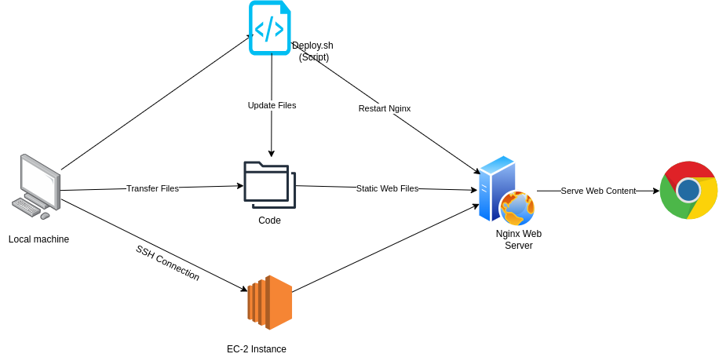

Here's the updated README with a professional touch, including an MIT license and contact information for contributions:

---

# Static Site Server with Nginx and rsync Deployment

## Overview

The goal of this project is to help you understand the basics of setting up a web server using a basic static site served using Nginx. You will also learn how to use `rsync` to deploy your changes to the server.

## Requirements

Here are the requirements for this project:

-   **I used AWS EC2 instance**.
-   Make sure that you can connect to your server using SSH.
-   Install and configure Nginx to serve a static site.
-   Create a simple webpage with basic HTML, CSS, and image files.
-   Use `rsync` to update a remote server with a local static site.
-   Write a `deploy.sh` script which, when executed, uses `rsync` to sync your static site to the server.

## Flow of the Project



## Step-by-Step Guide

### Step 1: Set Up a Remote Linux Server

1.  **Choose a Cloud Provider**:

    -   Use a cloud provider like AWS (Amazon Web Services), DigitalOcean, Google Cloud, or any other provider of your choice.
    -   For this guide, we’ll use AWS EC2 instance as an example.
2.  **Create an AWS EC2 Instance**:

    -   Log in to your AWS account.
    -   Navigate to EC2 and click "Launch Instance".
    -   Choose a suitable Linux AMI (Amazon Machine Image).
    -   Configure instance settings (choose an instance type, subnet, and security group).
    -   Once the instance is launched, connect via SSH using a terminal.

### Step 2: Connect to Your Server via SSH

1.  **Open Terminal** and use SSH to connect:

    ```bash
    ssh username@your-ec2-public-ip
    ```

    Replace `username` with your server’s username (commonly `ec2-user` or `ubuntu`) and `your-ec2-public-ip` with your EC2 instance’s public IP address.

2.  **Update the Server**:

    ```bash
    sudo apt update && sudo apt upgrade -y
    ```


### Step 3: Install Nginx

1.  Install Nginx on the server:

    ```bash
    sudo apt install nginx -y
    ```

2.  Start and enable Nginx:

    ```bash
    sudo systemctl start nginx
    sudo systemctl enable nginx
    ```

3.  Verify Nginx is running:

    ```bash
    sudo systemctl status nginx
    ```


### Step 4: Create a Static Site

1.  **Create a directory for your static site**:

    ```bash
    mkdir ~/static-site-server
    cd ~/static-site-server
    ```

2.  **Create basic HTML, CSS, and JavaScript files**:

    -   `index.html`:

        ```html
        <!DOCTYPE html>
        <html lang="en">
        <head>
            <meta charset="UTF-8">
            <meta name="viewport" content="width=device-width, initial-scale=1.0">
            <title>Static Site</title>
            <link rel="stylesheet" href="styles.css">
        </head>
        <body>
            <h1>Welcome to My Static Site</h1>
            <p>This is a simple static site served using Nginx.</p>
            <script src="script.js"></script>
        </body>
        </html>
        ```

    -   `styles.css`:

        ```css
        body {
            font-family: Arial, sans-serif;
            text-align: center;
            padding: 50px;
        }
        ```

    -   `script.js`:

        ```javascript
        console.log("Static site script loaded.");
        ```


### Step 5: Use rsync to Deploy Changes

1.  **Create the deploy.sh script**:

    ```bash
    touch deploy.sh
    chmod +x deploy.sh
    ```

2.  **Add the rsync command to `deploy.sh`**:

    ```bash
    echo 'rsync -avz -e "ssh" ./ ~/static-site-server/' > deploy.sh
    ```

3.  **Execute the deploy.sh script**:

    ```bash
    ./deploy.sh
    ```


### Step 6: Test the Static Site

1.  Open a web browser and visit your server's IP address:

    ```
    http://your-ec2-public-ip
    ```


### Step 7: Git Integration (Optional)

1.  **Initialize a Git Repository**:

    ```bash
    git init
    ```

2.  **Add files**:

    ```bash
    git add .
    ```

3.  **Commit changes**:

    ```bash
    git commit -m "Initial commit of static site"
    ```

4.  **Push to GitHub**:

    ```bash
    git remote add origin https://github.com/YourUsername/YourRepository.git
    git branch -M main
    git push -u origin main
    ```


## MIT License

This project is licensed under the MIT License. See the [LICENSE](https://chatgpt.com/c/LICENSE) file for details.

## Contribution

Contributions are welcome! If you’d like to contribute to this project, please feel free to:

-   Fork the repository on GitHub.
-   Create a new branch (`git checkout -b feature-name`).
-   Make your changes.
-   Push your changes (`git push origin feature-name`).
-   Submit a pull request.

---
